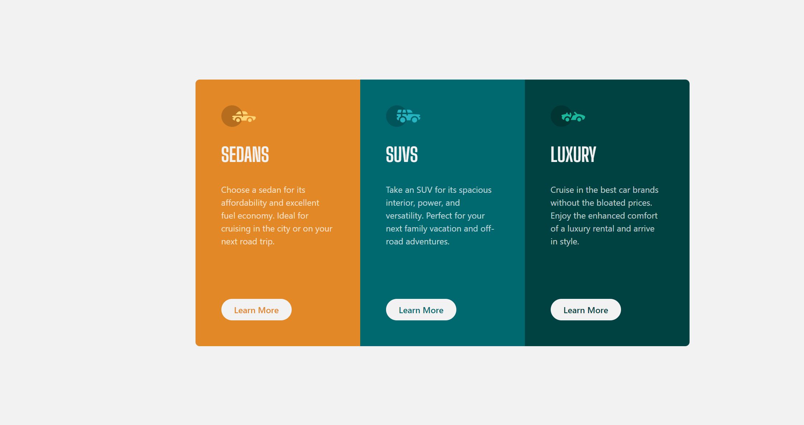

# Frontend Mentor - 3-column preview card component solution

This is a solution to the [3-column preview card component challenge on Frontend Mentor](https://www.frontendmentor.io/challenges/3column-preview-card-component-pH92eAR2-). Frontend Mentor challenges help you improve your coding skills by building realistic projects.

## Table of contents

- [Overview](#overview)
  - [The challenge](#the-challenge)
  - [Screenshot](#screenshot)
  - [Links](#links)
- [My process](#my-process)
  - [Built with](#built-with)
  - [What I learned](#what-i-learned)
- [Author](#author)

## Overview

### The challenge

Users should be able to:

- View the optimal layout depending on their device's screen size
- See hover states for interactive elements

### Screenshot

Mobile version


Desktop version



### Links

- Live Site URL: [https://ob-3-column-preview-card.netlify.app/](https://ob-3-column-preview-card.netlify.app/)
- Solution URL: [https://github.com/ob2code/3-column-preview-card](https://github.com/ob2code/3-column-preview-card)

## My process

### Built with

- Mobile-first workflow
- [Tailwind CSS](https://tailwindcss.com/) - A utility-first CSS framework

### What I learned

Center a main div vertically and horizontally with Tailwind:

```html
<body
  class="
     ...
      md:flex md:items-center md:justify-center md:h-screen
    "
></body>
```

Use @layer to customize CSS class

```css
@layer components {
  .btn {
    @apply py-2 px-6 bg-very-light-gray font-semibold rounded-3xl hover:text-very-light-gray/75 hover:ring-2 hover:ring-white/75;
  }
  .btn--sedan {
    @apply text-bright-orange hover:bg-bright-orange;
  }
  .btn--suvs {
    @apply text-dark-cyan hover:bg-dark-cyan;
  }
  .btn--luxury {
    @apply text-very-dark-cyan hover:bg-very-dark-cyan;
  }
}
```

## Author

- 💻Website [ob2code.netlify.app](https://ob2code.netlify.app/)
- 💪Frontend Mentor - [@ob2code](https://www.frontendmentor.io/profile/ob2code)
- 👨‍💻GitHub [@ob2code](https://github.com/ob2code)
- 🐤Twitter [@ob2code](https://twitter.com/ob2code)
